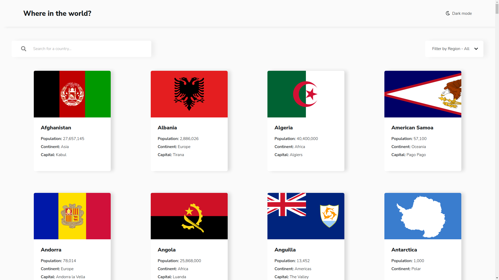

# Frontend Mentor - REST Countries API with color theme switcher solution



## Table of contents

- [Overview](#overview)
  - [The challenge](#the-challenge)
  - [Links](#links)
- [My process](#my-process)
  - [Built with](#built-with)
  - [What I learned](#what-i-learned)
  - [Useful resources](#useful-resources)
- [Author](#author)

## Overview

### The challenge

Users should be able to:

- See all countries from the API on the homepage
- Search for a country using an `input` field
- Filter countries by region
- Click on a country to see more detailed information on a separate page
- Click through to the border countries on the detail page
- Toggle the color scheme between light and dark mode _(optional)_

### Links

- [Visit the solution here](https://hamilton-i7.github.io/countries/#/)

## My process

### Built with

- Semantic HTML5 markup
- CSS custom properties
- Flexbox
- CSS Grid
- Mobile-first workflow
- [React](https://reactjs.org/) - JS library
- [Styled Components](https://styled-components.com/) - For styles
- [Font Awesome](https://fontawesome.com/) - For icons
- [React SPinners](https://www.npmjs.com/package/react-spinners) - For loading spinners
- [Axios](https://www.npmjs.com/package/axios) - For HTTP requests
- [REST Countries](https://restcountries.com/) - API

### What I learned

This was my first experience building a multipage website using React so I learned about React Router.

```js
ReactDOM.render(
  <React.StrictMode>
    <Router basename={HOME_PATH}>
      <App />
    </Router>
  </React.StrictMode>,
  document.getElementById('root'),
)
```

And for the styles, I wanted to try out Styled Components which I found pretty convenient since you're able to use props within the CSS.

```js
const StyledButton = styled(Button)`
  background-color: ${props => props.theme.surface};
  border: none;
  border-radius: 0.2rem;
  box-shadow: 0.5rem 0.5rem 0.8rem rgba(0, 0, 0, 0.08);
  cursor: pointer;
  margin: ${props => props.margin || 0};
  outline: none;
  padding: 0.6rem 2.4rem;
`
```

### Useful resources

- [Host React App](https://medium.com/swlh/create-deploy-host-react-app-for-free-github-pages-c1f41bed6497) - This helped me to deploy my app using Github Pages.

## Author

- Frontend Mentor - [@hamilton-i7](https://www.frontendmentor.io/profile/hamilton-i7)
- Twitter - [@hamilton_i7](https://twitter.com/hamilton_i7)
